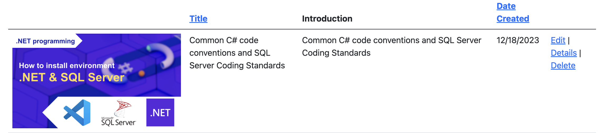

# Part 9: File Storage in .NET

>This tutorial will teach you how to store files using `Upload`, `GetFile`, `Delete` methods. Then interact with the file on the screen interface.

In this section:

- Store files using `Upload`, `GetFile`, `Delete` methods
- Interact with the file on the screen interface

Before coming to this guide, please refer to [Part 8: Introduction to relationships](https://github.com/NguyenPhuDuc307/introduction-relationship).

## Add a new `Image` field

Add a ImagePath property to Data/Entities/Lesson.cs:

```c#
using System.Net.Mime;
using System.ComponentModel.DataAnnotations;

namespace CourseManagement.Data.Entities;

public class Lesson
{
    public int Id { get; set; }
    public string? Title { get; set; }
    public string? ImagePath { get; set; }
    public string? Introduction { get; set; }
    public string? Content { get; set; }
    [DataType(DataType.Date)]
    public DateTime DateCreated { get; set; }

    public int CourseId { get; set; }
    public Course? Course { get; set; }
}
```

Add a ImagePath property to ViewModels/LessonViewModel.cs and ViewModels/LessonRequest.cs:

```c#
using System.Net.Mime;
using System.ComponentModel.DataAnnotations;

namespace CourseManagement.ViewModels;

public class LessonRequest
{
    [StringLength(60, MinimumLength = 3)]
    [Required]
    public string? Title { get; set; }
    public IFormFile? Image { get; set; }
    [Required]
    public string? Introduction { get; set; }
    public string? Content { get; set; }
    [Required]
    [Display(Name = "Course")]
    public int CourseId { get; set; }
}

public class LessonViewModel
{
    public int Id { get; set; }
    public string? Title { get; set; }
    public string? ImagePath { get; set; }
    public IFormFile? Image { get; set; }
    public string? Introduction { get; set; }
    public string? Content { get; set; }
    [Display(Name = "Date Created")]
    [DataType(DataType.Date)]
    public DateTime DateCreated { get; set; }
    [Display(Name = "Course")]
    public int CourseId { get; set; }
    [Display(Name = "Course")]
    public int CourseName { get; set; }
}
```

Build the app:

```bash
dotnet build
```

Run the following .NET CLI commands:

```bash
dotnet ef migrations add AddImageInLesson
```

```bash
dotnet ef database update
```

## Create a  file storage service

Create a new interface named `IStorageService` in the `Services` folder. Replace the generated code with the following:

```c#
namespace CourseManagement.Services
{
    public interface IStorageService
    {
        string GetFileUrl(string fileName);

        Task SaveFileAsync(Stream mediaBinaryStream, string fileName);

        Task DeleteFileAsync(string fileName);
    }
}
```

Create a new class named `FileStorageService` in the `Services` folder. This class implement `IStorageService` interface. Replace the generated code with the following:

```c#
namespace CourseManagement.Services
{
    public class FileStorageService : IStorageService
    {
        private readonly string _userContentFolder;
        private const string USER_CONTENT_FOLDER_NAME = "user-content";

        public FileStorageService(IWebHostEnvironment webHostEnvironment)
        {
            _userContentFolder = Path.Combine(webHostEnvironment.WebRootPath, USER_CONTENT_FOLDER_NAME);
        }

        public string GetFileUrl(string fileName)
        {
            return $"/{USER_CONTENT_FOLDER_NAME}/{fileName}";
        }

        public async Task SaveFileAsync(Stream mediaBinaryStream, string fileName)
        {
            if (!Directory.Exists(_userContentFolder))
                Directory.CreateDirectory(_userContentFolder);

            var filePath = Path.Combine(_userContentFolder, fileName);
            using var output = new FileStream(filePath, FileMode.Create);
            await mediaBinaryStream.CopyToAsync(output);
        }

        public async Task DeleteFileAsync(string fileName)
        {
            var filePath = Path.Combine(_userContentFolder, fileName);
            if (File.Exists(filePath))
            {
                await Task.Run(() => File.Delete(filePath));
            }
        }
    }
}
```

### Register services for DI

```c#
//File Storage
builder.Services.AddTransient<IStorageService, FileStorageService>();
```

## Using in LessonsService

Inject dependency into service:

```c#
private readonly CourseDbContext _context;
private readonly IMapper _mapper;
private readonly IStorageService _storageService;
private const string USER_CONTENT_FOLDER_NAME = "user-content";

public LessonsService(CourseDbContext context, IMapper mapper, IStorageService storageService)
{
    _context = context;
    _mapper = mapper;
    _storageService = storageService;
}
```

Create a new function `SaveFile`:

```c#
private async Task<string> SaveFile(IFormFile file)
{
    var originalFileName = ContentDispositionHeaderValue.Parse(file.ContentDisposition).FileName!.Trim('"');
    var fileName = $"{Guid.NewGuid()}{Path.GetExtension(originalFileName)}";
    await _storageService.SaveFileAsync(file.OpenReadStream(), fileName);
    return "/" + USER_CONTENT_FOLDER_NAME + "/" + fileName;
}
```

Call methods Upload, GetFile and Delete files, upload LessonsService following the code:

```c#
using System.Drawing.Printing;
using System.Net.Http.Headers;
using AutoMapper;
using CourseManagement.Data;
using CourseManagement.Data.Entities;
using CourseManagement.ViewModels;
using Microsoft.EntityFrameworkCore;

namespace CourseManagement.Services
{
    public class LessonsService : ILessonsService
    {
        private readonly CourseDbContext _context;
        private readonly IMapper _mapper;
        private readonly IStorageService _storageService;
        private const string USER_CONTENT_FOLDER_NAME = "user-content";

        public LessonsService(CourseDbContext context, IMapper mapper, IStorageService storageService)
        {
            _context = context;
            _mapper = mapper;
            _storageService = storageService;
        }

        private async Task<string> SaveFile(IFormFile file)
        {
            var originalFileName = ContentDispositionHeaderValue.Parse(file.ContentDisposition).FileName!.Trim('"');
            var fileName = $"{Guid.NewGuid()}{Path.GetExtension(originalFileName)}";
            await _storageService.SaveFileAsync(file.OpenReadStream(), fileName);
            return "/" + USER_CONTENT_FOLDER_NAME + "/" + fileName;
        }

        public async Task<int> Create(LessonRequest request)
        {
            var lesson = _mapper.Map<Lesson>(request);

            // Save image file
            if (request.Image != null)
            {
                lesson.ImagePath = await SaveFile(request.Image);
            }
            _context.Add(lesson);
            return await _context.SaveChangesAsync();
        }

        public async Task<int> Delete(int id)
        {
            var lesson = await _context.Lessons.FindAsync(id);
            if (lesson != null)
            {
                if (!string.IsNullOrEmpty(lesson.ImagePath))
                    await _storageService.DeleteFileAsync(lesson.ImagePath.Replace("/" + USER_CONTENT_FOLDER_NAME + "/", ""));
                _context.Lessons.Remove(lesson);
            }
            return await _context.SaveChangesAsync();
        }

        public async Task<PaginatedList<LessonViewModel>> GetAllFilter(string sortOrder, string currentFilter, string searchString, int? pageNumber, int pageSize)
        {
            if (searchString != null)
            {
                pageNumber = 1;
            }
            else
            {
                searchString = currentFilter;
            }

            var lessons = from m in _context.Lessons select m;

            if (!String.IsNullOrEmpty(searchString))
            {
                lessons = lessons.Where(s => s.Title!.Contains(searchString)
                || s.Introduction!.Contains(searchString));
            }

            lessons = sortOrder switch
            {
                "title_desc" => lessons.OrderByDescending(s => s.Title),
                "date_created" => lessons.OrderBy(s => s.DateCreated),
                "date_created_desc" => lessons.OrderByDescending(s => s.DateCreated),
                _ => lessons.OrderBy(s => s.Title),
            };

            return PaginatedList<LessonViewModel>.Create(_mapper.Map<IEnumerable<LessonViewModel>>(await lessons.ToListAsync()), pageNumber ?? 1, pageSize);
        }

        public async Task<LessonViewModel> GetById(int id)
        {
            var lesson = await _context.Lessons
                .FirstOrDefaultAsync(m => m.Id == id);
            return _mapper.Map<LessonViewModel>(lesson);
        }

        public async Task<int> Update(int Id, LessonViewModel request)
        {
            if (!LessonExists(request.Id))
            {
                throw new Exception("Lesson does not exist");
            }
            // Save image file
            if (request.Image != null)
            {
                if (!string.IsNullOrEmpty(request.ImagePath))
                    await _storageService.DeleteFileAsync(request.ImagePath.Replace("/" + USER_CONTENT_FOLDER_NAME + "/", ""));
                request.ImagePath = await SaveFile(request.Image);
            }

            _context.Update(_mapper.Map<Lesson>(request));
            return await _context.SaveChangesAsync();
        }

        private bool LessonExists(int id)
        {
            return _context.Lessons.Any(e => e.Id == id);
        }
    }
}
```

## Add Image Request and ViewModel in view

Update the form with the following code: ```<form asp-action="Create" enctype="multipart/form-data">```.

Add image request and image preview in view `Create`:

```html
<div class="form-group">
    <label asp-for="Image" class="control-label"></label>
    <input asp-for="Image" type="file" class="form-control" id="image-input" onchange="previewImage(event)"
        accept="image/*" />
    <span asp-validation-for="Image" class="text-danger"></span>
</div>
<div class="image-preview my-2">
    
</div>
```

```js
<script>
    $(document).ready(function () {
        $('#image-input').change(function () {
            var input = this;

            if (input.files && input.files[0]) {
                var reader = new FileReader();

                reader.onload = function (e) {
                    $('#preview').attr('src', e.target.result).removeClass('d-none');
                }

                reader.readAsDataURL(input.files[0]);
            } else {
                $('#preview').addClass('d-none');
            }
        });
    });
</script>
```

Add image request and image preview in view `Create`:

```html
<input type="hidden" asp-for="ImagePath" />
<div class="form-group">
    <label asp-for="Image" class="control-label"></label>
    <input asp-for="Image" type="file" class="form-control" id="image-input" onchange="previewImage(event)"
        accept="image/*" />
    <span asp-validation-for="Image" class="text-danger"></span>
</div>
<div class="image-preview my-2">
    
</div>
```

```js
<script>
    $(document).ready(function () {
        $('#image-input').change(function () {
            var input = this;

            if (input.files && input.files[0]) {
                var reader = new FileReader();

                reader.onload = function (e) {
                    $('#preview').attr('src', e.target.result).removeClass('d-none');
                }

                reader.readAsDataURL(input.files[0]);
            } else {
                $('#preview').addClass('d-none');
            }
        });

        var imagePath = "@Model.ImagePath";
        if (imagePath == null || imagePath.trim() === "") {
            $('#preview').addClass('d-none');
        }
    });
</script>
```

Then you display them on other views depending on requirements.

**Final, run the application to test functions:**

Run the following command:

```bash
dotnet watch run
```




Please refer to the code in this repository for more information.

Next let's [Part 10: Create a web API with ASP.NET Core](https://github.com/NguyenPhuDuc307/web-api).
